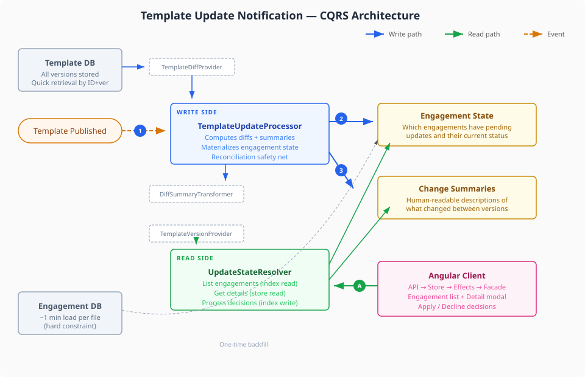
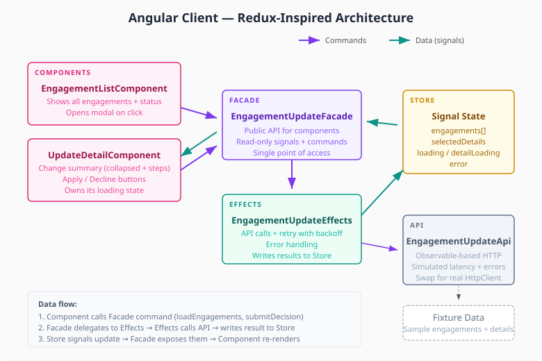

# Template Update Notification System

Take-home exercise for **Senior Full Stack Developer (Java + Angular)** at Caseware.

## Problem

Audit firms work in Engagement Files created from Product Templates. When templates are updated, users need to:
- See which engagements have pending updates
- Review a human-readable summary of what changed
- Decide to apply or decline each update

**Key constraint:** Loading an engagement file takes ~1 minute (hard constraint), so the system uses a lightweight index to avoid loading engagements at query time.

## Architecture

The system follows a **CQRS pattern** separating event processing from client queries:



- **Write side** (`TemplateUpdateProcessor`): When a template is published, computes diffs, generates human-readable summaries, and materializes engagement state in the index.
- **Read side** (`UpdateStateResolver`): Serves client queries as pure lookups against pre-computed data. Handles apply/decline decisions with optimistic concurrency.



The Angular client uses a **Redux-inspired architecture** with signals: API → Store → Effects → Facade → Components.

## Project Structure

```
submission/
├── DESIGN.md              ← Part 1: Architecture & design document
├── SUBMISSION.md          ← Assumptions, AI usage, time spent
├── diagrams/              ← Architecture diagrams (SVG)
├── server/                ← Part 2: Java 21 domain implementation
│   └── src/
│       ├── domain/
│       │   ├── model/     ← Records and enums (15 types)
│       │   ├── port/      ← Port interfaces (5 boundaries)
│       │   └── service/   ← Domain services (2: write + read)
│       ├── adapter/       ← Rule-based diff transformer
│       └── test/          ← JUnit 5 tests (14 scenarios)
└── client/                ← Part 3: Angular 18+ implementation
    └── src/app/
        ├── models/        ← TypeScript interfaces mirroring API contract
        ├── data/          ← Fixture data (sample engagements + details)
        ├── api/           ← Observable-based API simulation
        ├── store/         ← Signal-based state container
        ├── effects/       ← Side effects with retry + exponential backoff
        ├── facades/       ← Public API for components
        ├── components/    ← Engagement list + Update detail modal
        └── tests/         ← Facade integration tests (6 scenarios)
```

## Key Documents

- **[DESIGN.md](DESIGN.md)** — High-level architecture, API contract, testing strategy, failure modes
- **[SUBMISSION.md](SUBMISSION.md)** — Assumptions, AI usage details, time breakdown (~4.5h), next steps
